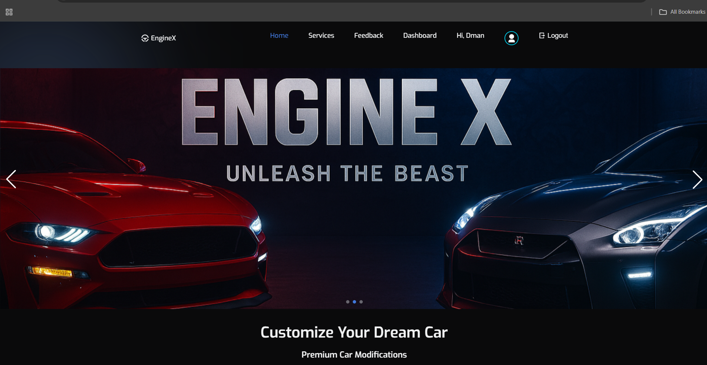
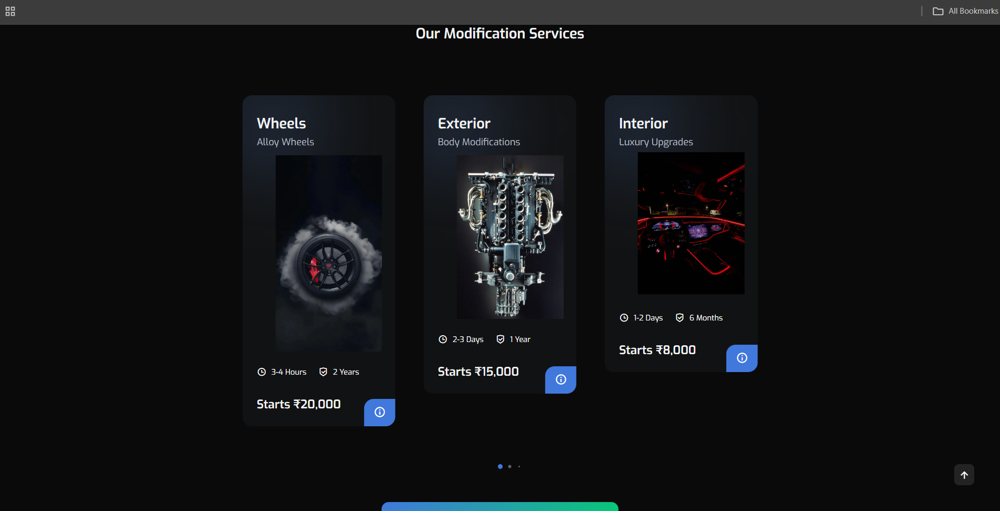
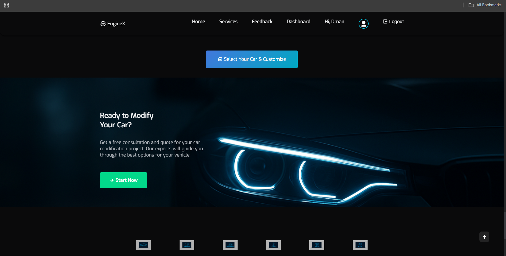
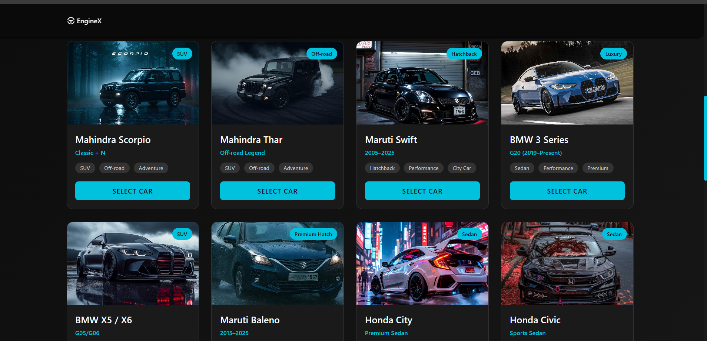
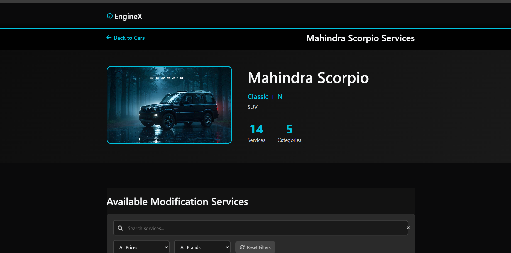
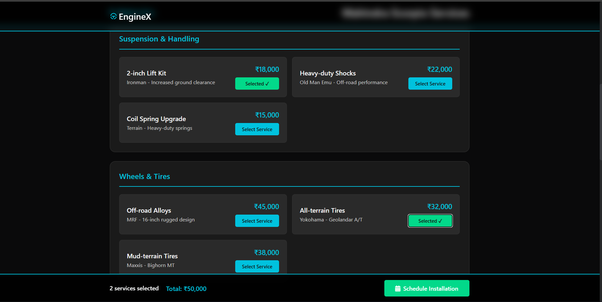
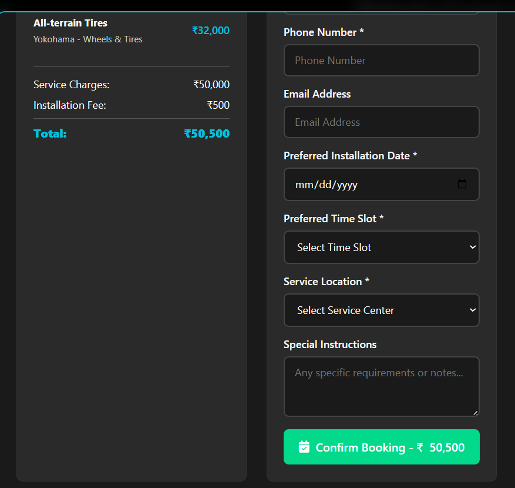
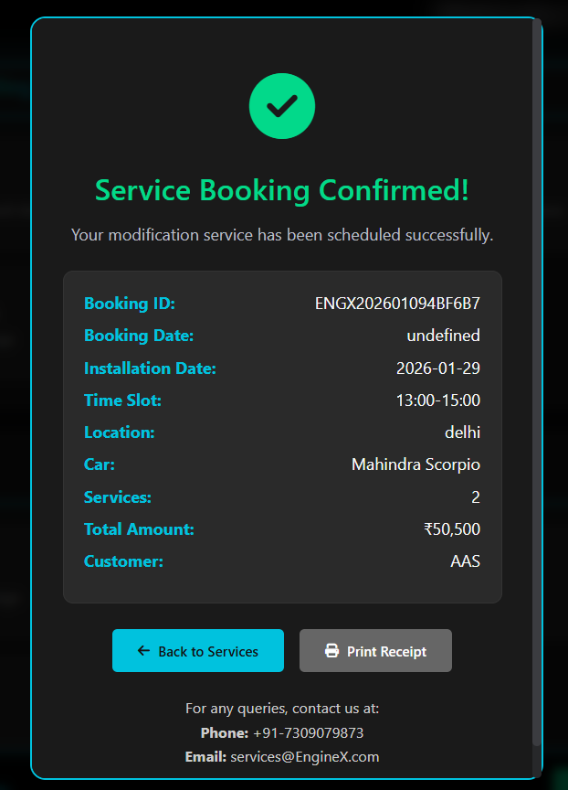

# 🚗 EngineX — Smart Car Modification & Booking Platform
**Full-Stack Web Application (Flask + SQLite)**


---

## 📌 Overview

**EngineX** is a full-stack web platform that connects **car owners** with **professional car modification workshops**.  
The system allows users to explore car accessories, compare price ranges, select services, choose nearby shops, and book installations online.

Workshops can manage their shop profiles, upload supported cars, list accessories, and receive real-time booking notifications via Telegram.

---

## ✨ Features

### Customer Features
- Animated and responsive landing page  
- Car selection by model  
- Accessory browsing with global price ranges  
- Real-time price calculation  
- Location-based shop discovery  
- Online booking with scheduling  

### Shopkeeper Features
- Shop registration and profile management  
- Upload supported car models  
- Add, edit, and delete accessories  
- Manage service availability  
- Receive booking alerts  

### System Capabilities
- Global accessory price aggregation (min–max)  
- Secure authentication system  
- REST API architecture  
- Telegram bot integration  
- SQLite database with SQLAlchemy ORM  

---

## 🖥️ Screenshots

### Home Page




---

### Car Selection


---

### Modifications & Accessories



---

### Booking & Scheduling



---

## 🧠 System Architecture

Client (Browser)
   |
   |  HTML / CSS / JavaScript
   v
Flask Backend (main.py)
   |
   |  REST APIs (/api/*)
   v
SQLite Database (enginex.db)
   |
   |  Booking Events
   v
Telegram Bot Notifications


---

## 📂 Project Structure


EngineX/
│
├── env/                      # Python virtual environment
│
├── instance/
│   └── enginex.db            # SQLite database
│
├── screenshots/              # README screenshots
│
├── static/
│   ├── css/
│   ├── img/
│   └── js/
│
├── templates/
│   ├── auth/
│   │   ├── login.html
│   │   ├── register.html
│   │   └── profile.html
│   │
│   ├── shop/
│   │   ├── dashboard.html
│   │   ├── create.html
│   │   ├── services.html
│   │   └── bookings.html
│   │
│   ├── index.html
│   ├── car-selection.html
│   └── modifications.html
│
├── main.py                   # Flask backend
├── requirements.txt
├── bookings_log.txt
├── sms_log.txt
└── README.md

---

## 📡 API Endpoints

| Method | Endpoint | Description |
|------|----------|-------------|
| POST | `/api/bookings` | Create booking and send notification |
| GET  | `/api/bookings` | Retrieve all bookings |
| POST | `/api/login` | User authentication |
| POST | `/api/register` | User registration |
| POST | `/api/shop/services/add` | Add shop services |

---

### Sample Booking Request

```json
{
  "customer": {
    "name": "Adarsh Singh",
    "phone": "9876543210",
    "email": "xyz@gmail.com",
    "date": "2025-01-20",
    "timeSlot": "11:00 AM – 1:00 PM",
    "location": "Delhi"
  },
  "booking": {
    "car": "BMW 3 Series",
    "total": 85000,
    "services": [
      { "name": "ECU Remap", "price": 25000 },
      { "name": "Performance Exhaust", "price": 60000 }
    ]
  }
}
